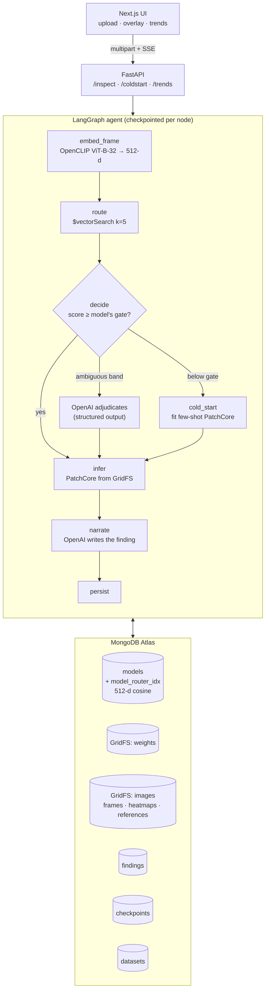

# GridSight

**A vector-routed machine-vision model registry for infrastructure inspection.**

Utilities and rail operators already fly drones over millions of miles of line and track, and vision
models that catch the defects behind wildfires and derailments already work. The missing piece is
*routing*: every asset class needs its own specialist, and nothing decides which specialist to run on
which frame. GridSight is that decider. MongoDB holds a registry of anomaly-detection models; each
model document carries a 512-d embedding of the imagery it was trained on. An agent embeds an
incoming frame, `$vectorSearch`es the registry, loads the winning specialist straight out of GridFS,
and runs it. If nothing clears the winner's coverage gate, the agent **refuses to guess**, says so,
and cold-starts a new specialist from a handful of reference images — which then lives in the
registry for every future flight.

---

## Why Atlas, not a local mongod

Atlas is a hard requirement here, not a preference: `$vectorSearch` is an Atlas-only aggregation
stage, and a self-hosted `mongod` simply does not implement it, so the vector index that *is* the
entire premise of this project cannot be built or queried anywhere else — routing a frame to the
right specialist is a k-NN query over 512-d CLIP centroids, and without Atlas there is no index to
run it against. GridSight puts three more things in the same cluster for the same reason: the model
weights themselves live in GridFS (a PatchCore coreset is a few megabytes, so the registry entry and
the artifact it points at never drift apart), the LangGraph checkpoints live in `checkpoints` /
`checkpoint_writes` so a `kill -9` mid-training resumes instead of relearning, and the findings live
alongside both so the fleet-health aggregations run where the data already is. GridSight does ship an
offline fallback — if the index is missing, `PENDING`, or the aggregation errors, `vector_search()`
degrades to brute-force cosine similarity over every registry document — but it logs
`ATLAS VECTOR SEARCH UNAVAILABLE … DEGRADING TO BRUTE-FORCE COSINE` at ERROR on every single call and
the `/health` endpoint reports the index status, because a silent fallback would make a broken
deployment look like a working one.

---

## Architecture



The routing embedding is deliberately **not** an OpenAI embedding: OpenAI's embedding endpoints are
text-only and cannot embed a drone frame. Routing uses local OpenCLIP; OpenAI is used only for
reasoning — adjudicating ambiguous routes, naming newly minted models, and writing the finding.

### How routing actually decides

A single global threshold does not work here, and the measurements say so. Atlas scores cosine
similarity as `(1 + cos) / 2`, which compresses every natural image into roughly `[0.75, 0.96]`, so
one cut point cannot both accept in-registry frames and reject out-of-registry ones. Instead **each
model stores its own coverage gate** — the 5th percentile of its own training set's similarity to its
own centroid, i.e. the envelope it demonstrably learned. A frame routes only if it clears the winning
model's gate; `ROUTE_THRESHOLD` (default `0.82`, env-tunable) remains an additional floor that can
only make the gate stricter. Measured over 125 in-registry and 25 out-of-registry held-out frames:

| decision rule | in-registry accepted | out-of-registry refused |
|---|---|---|
| global 0.82 | 123/125 | 10/25 |
| global 0.86 | 107/125 | 23/25 |
| global 0.88 | 91/125 | 25/25 |
| **per-model coverage gate** | **115/125** | **24/25** |

Between the gate and the floor sits a 0.04-wide ambiguous band, and only frames landing there are
handed to OpenAI with the top-5 candidate metadata for a structured-output adjudication.

---

## Asset classes and where the imagery came from

`gridsight/ingest/hf_scrape.py` queries the Hugging Face Hub programmatically for ten search terms,
filters the results to repos that actually carry image features, and logs why each source was
selected or rejected (`data/ingest_report.json`). Nothing is generated: every pixel came out of a
real Hub dataset, transformed only by cropping to a labelled region, resizing the longest edge to
512px, and perceptual-hash deduplication.

| asset class | train/good | test/good | test/defect | source | normal vs anomalous |
|---|---|---|---|---|---|
| `insulator` | 120 | 30 | 40 | `docmhvr/powerline-components-and-faults` | `Insulators` vs `Broken Insulator` boxes |
| `conductor` | 106 | 27 | 40 | `docmhvr/powerline-components-and-faults` | `Cable` vs `Broken Cable` boxes |
| `transmission_tower` | 120 | 30 | 40 | `docmhvr/powerline-components-and-faults` | tower crop with vs without a broken component on it |
| `vegetation` | 120 | 30 | 40 | `docmhvr/powerline-components-and-faults` | canopy clear of conductors vs intersecting one (encroachment) |
| `corrosion` | 120 | 30 | 40 | `khoaliamle/Corrosion_Rust` (MIT) | `no rust` vs `rust` folders |
| `rail_surface` | 120 | 30 | 40 | `crangana/railroad-fault-detection` | `Non-defective` vs `Defective` folders |

Two selection notes worth stating plainly, both recorded in the `datasets` collection:

- **No Hub dataset labels transmission-tower structural damage.** Searches for *transmission tower
  damage*, *tower defect* and *structural damage* returned nothing usable, so the nearest real
  alternative is used: a tower is anomalous when a labelled broken component sits on it.
- **The rail corpora that dominate search are defect-only.** `Dhika/rail_defect` has 1219 images
  across 134 defect-combination folders and *no normal class at all*, which makes it unusable for
  PatchCore (which fits on good images only). `crangana/railroad-fault-detection` was chosen because
  it is the only rail hit carrying an explicit `Non-defective` class.

### Crops are scale-separated, and that was a measured decision

These classes are **nested** — a tower box literally contains insulators and cables — so the first
crop policy (25% context padding, 96px minimum) embedded every powerline crop to nearly the same
place and routing collapsed to 61% top-1. Centering the embedding space did not help (61% → 63%).
Tight crops helped a little (69%). What worked was making *scale* the discriminator, since that is
what genuinely distinguishes a whole-structure frame from a component close-up: towers must be boxes
≥180px, components ≤160px (conductors ≤200px), cropped tight and upscaled rather than padded with
background. That took top-1 to **88%** on balanced pools. On the shipped corpus, live against Atlas,
top-1 is **79%** (99/125) with 115/125 accepted and 24/25 out-of-registry frames refused.

---

## Setup

```bash
uv venv --python 3.12 && uv sync --all-groups
```

`.env` is git-ignored and must contain `MONGODB_URI`, `MONGODB_DB`, `OPENAI_API_KEY`, and `HF_TOKEN`.

```bash
# Phase 1 — scrape ~6 asset classes from the Hugging Face Hub (idempotent; rerun is a no-op)
uv run python -m gridsight.ingest.hf_scrape

# Phases 2+3 — create the Atlas vector index (polls to READY), then train and register
# the seeded specialists. rail_surface is deliberately withheld for the cold-start demo.
uv run python -m gridsight.train.train_class \
  --classes insulator conductor transmission_tower vegetation corrosion \
  --thread-id fleet-v3

# resume a run that died mid-training, instead of relearning what is already registered
uv run python -m gridsight.train.train_class --resume --thread-id fleet-v3
```

```bash
# API
uv run uvicorn gridsight.api.main:app --host 127.0.0.1 --port 8000
```

```bash
# UI
pnpm --dir web install && pnpm --dir web dev
```

Verification and evidence scripts:

```bash
uv run python scripts/verify_routing.py      # live $vectorSearch + decision-rule comparison
uv run python scripts/agent_demo.py          # the three agent scenarios, end to end
uv run python scripts/kill_resume_test.py    # SIGKILL mid-training, then --resume
uv run python scripts/seed_findings.py --per-class 5 --spread-days 14
```

Checks:

```bash
uv run ruff check gridsight tests scripts && uv run mypy && uv run pytest && pnpm --dir web build
```

> `seed_findings.py --spread-days` runs **real** inference on real held-out frames; only the
> `timestamp` is shifted so the trends view has a timeline, and every such document is flagged
> `backfilled: true` with its true `observed_at`. Nothing else about a finding is synthetic.

---

## Collections

| collection | contents |
|---|---|
| `models` | registry: name, asset class, backbone, **512-d embedding**, `routing_threshold` (coverage gate), image/pixel thresholds, `weights_file_id`, `reference_image_id`, training samples, metrics, `created_by` (`seed` \| `agent-coldstart`), provenance |
| `findings` | one row per inspected frame: verdict, routed model, routing score, anomaly score, severity, bbox regions, heatmap id, agent narrative, latency |
| `datasets` | Phase 1 provenance: dataset id, licence, selection rationale, extraction notes, counts |
| `checkpoints` / `checkpoint_writes` | owned by the LangGraph MongoDB checkpointer |
| `weights.*` (GridFS) | serialized PatchCore coresets + post-processor thresholds |
| `images.*` (GridFS) | uploaded frames, heatmaps, golden reference exemplars |

A registry entry stores the **coreset memory bank and thresholds**, not the frozen ImageNet backbone,
which is reconstructed by name at load time. That is what keeps a model ~7 MB instead of ~250 MB and
six models comfortably inside an M0's 512 MB ceiling (current usage is reported by `/health`).

---

## 90-second demo script

1. **(0:00) The registry.** Open `/registry`. Five specialists, each with its golden known-good
   exemplar, its 512-d routing embedding, its coverage gate, and its weights size. The badge at the
   top reads *Vector index READY* — that is `model_router_idx`, 512-d cosine, created over the driver
   and polled to READY, never through the console.
2. **(0:15) Routing works.** On `/`, drop `web/public/demo/insulator_defect.png`. Watch the live
   agent steps: *embedding → searching registry → routed to insulator-patchcore-v1 at 0.86 → running
   inference*. The result shows the frame with the heatmap and outlined regions beside the registry's
   golden insulator, plus the full candidate table — every runner-up and the gate it failed.
3. **(0:35) A different asset picks a different specialist.** Drop
   `web/public/demo/corrosion_defect.png`. `corrosion-patchcore-v1` wins at 0.92; the insulator model
   is now second at 0.83, *below* its own 0.84 gate.
4. **(0:50) It refuses rather than guessing.** Drop `web/public/demo/rail_defect.png` — railroad
   track, an asset class deliberately never trained. Best candidate scores 0.81 against corrosion's
   0.87 gate, so the agent returns **unroutable** and says so in plain language instead of scoring it.
5. **(1:05) Cold start.** The UI offers an inline uploader. Give it the 8 known-good frames in
   `web/public/demo/rail_refs/`, name the class `rail_surface`, submit. In ~4 seconds it fits a
   few-shot PatchCore, has OpenAI name it, writes the weights to GridFS, and registers it — then
   re-runs the original frame against the model that did not exist a moment ago.
6. **(1:20) It is now a first-class registry citizen.** Re-drop the same rail frame. It routes to
   `rail-surface-patchcore-v1` at **0.9467** — no cold start, no refusal. Nothing is relearned.
7. **(1:30) Fleet health.** `/trends`: defect rate over time per asset class, severity distribution,
   verdict mix including refusals, and the ranking of which component is degrading fastest — all
   MongoDB aggregation pipelines over `findings`.

---

## Honest limits

- **Image AUROC varies a lot by class**, and these are measured, not tuned: insulator 0.910,
  conductor 0.834, transmission_tower 0.717, corrosion 0.628, vegetation 0.490. Vegetation is at
  chance — "canopy overlapping a conductor" is a geometric label, not a visual texture, so PatchCore
  has little to latch onto. It is reported rather than dropped.
- **Pixel AUROC is `null` everywhere.** None of these Hub datasets ship ground-truth masks, so it is
  genuinely unmeasurable; anomalib leaves `_pixel_threshold` as NaN for the same reason. GridSight
  calibrates the pixel threshold from the p99.5 of anomaly maps over known-good training images and
  records that policy on the model document, rather than inventing a number.
- **Top-1 routing is 79%, not 100%.** The powerline component classes are genuinely nested in this
  corpus. The gate is what keeps that honest: a misroute inside the powerline family still lands on a
  powerline specialist, and anything outside the registry is refused 24/25 times.
- A cold-started model's threshold comes from ~8 reference images, so its normal envelope is tight
  and it flags aggressively until it is retrained on a fuller set.
