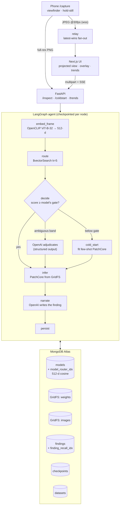

# Ambit

**A registry of inspection competence — and a router that knows when to refuse.**

The most dangerous thing a quality-control model can do is confidently pass a board it has never
seen. Vision models that find defects already work; what does not exist is anything that decides
**which model to run, and whether any of them should run at all.**

Ambit is that decider. MongoDB Atlas holds a registry of anomaly-detection specialists, each model
document carrying a 512-d embedding of the imagery it was trained on and a **coverage gate** — the
envelope it demonstrably learned. An agent embeds an incoming frame, `$vectorSearch`es the registry,
loads the winning specialist straight out of GridFS, and runs it. If nothing clears the winner's
gate, the agent **refuses to guess**, says so, and can cold-start a new specialist from a handful of
known-good references — which then lives in the registry for every future board.

The name is the thesis: an *ambit* is the bounds of what something covers.

---

## The result that matters

Five specialists are registered. A sixth board, `visa_pcb4`, is deliberately withheld — the registry
has never seen it. Measured over 125 in-registry and 25 out-of-registry held-out frames:

| decision rule | in-registry accepted | out-of-registry refused |
|---|---|---|
| global threshold 0.82 | 125/125 | **0/25** |
| global threshold 0.86 | 125/125 | **0/25** |
| global threshold 0.88 | 125/125 | **0/25** |
| **per-model coverage gate** | 119/125 | **25/25** |

The withheld board scores **0.9399 mean / 0.9525 max** against the registry — *above every global
threshold tested*. **No fixed cut point can refuse it at all**, because it genuinely *is* a PCB and
the registry is full of PCBs. Only the per-model gate declines it, 25 times out of 25.

That is the whole argument in one table. The system knows it is looking at a PCB-like object and
still declines, because no specialist has competence over *that particular board* — which is exactly
what happens when a hardware team spins Rev C on Tuesday.

The refusal is a **near miss**, not an obvious mismatch: `visa_pcb4` scores 0.9428 against
`visa_pcb3`, landing inside the 0.04 ambiguous band below that model's gate, so the agent escalates
to OpenAI with the top-5 candidate metadata and **OpenAI adjudicates the refusal**. The trace reads
*"Ambiguous at 0.9428; openai refused to route"*.

Cost of that refusal, stated plainly: 6 of 125 in-registry frames are refused too. At prototype
volume, re-shooting six frames is cheaper than passing one uninspected board.

**Top-1 routing is 125/125 (100%)** — including `pcb1` and `pcb2`, which turn out to be the two faces
of the same HC-SR04 board (0.8797 centroid similarity, the closest pair in the registry) and still
separate 25/25.

---

## Why Atlas, not a local mongod

`$vectorSearch` is an Atlas-only aggregation stage. A self-hosted `mongod` does not implement it, so
the vector index that *is* the premise of this project cannot be built or queried anywhere else —
routing a frame is a k-NN query over 512-d CLIP centroids. Three more things live in the same
cluster for the same reason: PatchCore weights in GridFS (a coreset is ~7 MB, so the registry entry
and the artifact it points at never drift apart), LangGraph checkpoints in `checkpoints` /
`checkpoint_writes` so a `kill -9` mid-training resumes instead of relearning, and findings
alongside both so fleet-health aggregations run where the data already is.

There *is* an offline fallback — if the index is missing, `PENDING`, or the aggregation errors,
`vector_search()` degrades to brute-force cosine over every registry document — but it logs
`ATLAS VECTOR SEARCH UNAVAILABLE … DEGRADING TO BRUTE-FORCE COSINE` at ERROR on every call, and
`/health` reports index status, because a silent fallback makes a broken deployment look healthy.

Atlas usage: **62 MB / 512 MB** (12.1%) on an M0.

---

## Architecture



The routing embedding is deliberately **not** an OpenAI embedding: OpenAI's embedding endpoints are
text-only and cannot embed an inspection frame. Routing uses local OpenCLIP; OpenAI is used only for
reasoning — adjudicating ambiguous routes, naming new models, and writing findings.

### How routing actually decides

A single global threshold cannot work, and the measurements say so. Atlas scores cosine similarity as
`(1 + cos) / 2`, compressing every natural image into roughly `[0.75, 0.96]`, so one cut point cannot
both accept in-registry frames and reject out-of-registry ones. Instead **each model stores its own
coverage gate** — a low percentile of its own held-out training frames' similarity to its own
centroid, floored by a minimum margin. A frame routes only if it clears the winning model's gate.

Inter-model centroid similarity (minimum gate in the registry is 0.9629):

| | cable | transistor | pcb1 | pcb2 | pcb3 |
|---|---|---|---|---|---|
| **mvtec_cable** | 1.0000 | 0.7281 | 0.6711 | 0.6723 | 0.6494 |
| **mvtec_transistor** | 0.7281 | 1.0000 | 0.7289 | 0.7716 | 0.7547 |
| **visa_pcb1** | 0.6711 | 0.7289 | 1.0000 | 0.8797 | 0.8626 |
| **visa_pcb2** | 0.6723 | 0.7716 | 0.8797 | 1.0000 | 0.9077 |
| **visa_pcb3** | 0.6494 | 0.7547 | 0.8626 | 0.9077 | 1.0000 |

Every off-diagonal sits below every gate, so cross-class traffic is not merely unlikely — it is
inadmissible.

---

## The registry, and what licence each model carries

| class | source | licence | image AUROC | pixel AUROC | gate |
|---|---|---|---|---|---|
| `visa_pcb1` | VisA | **CC BY 4.0** | 0.8967 | 0.9873 | 0.9794 |
| `visa_pcb2` | VisA | **CC BY 4.0** | 0.8600 | 0.9717 | 0.9797 |
| `visa_pcb3` | VisA | **CC BY 4.0** | 0.9967 | 0.9755 | 0.9801 |
| `mvtec_transistor` | MVTec AD | CC BY-NC-SA 4.0 | 0.9967 | 0.9456 | 0.9692 |
| `mvtec_cable` | MVTec AD | CC BY-NC-SA 4.0 | 0.9933 | 0.9892 | 0.9629 |
| `visa_pcb4` | VisA | CC BY 4.0 | — **withheld** — | — | — |

Licence is a positioning constraint, not an appendix, and the registry UI states it per model:

- **VisA (`pcb1`–`pcb4`) is CC BY 4.0** — attribution only. The PCB classes carry the commercial story.
- **MVTec AD (`transistor`, `cable`) is CC BY-NC-SA 4.0** — non-commercial, and ShareAlike
  propagates. Demo, research and internal evaluation only; never in a shipped product.

Pixel AUROC is real for every class, because both corpora ship per-defect ground-truth masks.

---

## Inspecting from a phone

`scripts/tunnel.sh` exposes the API over HTTPS and prints a QR. The phone opens `/capture`, streams a
480×360 viewfinder to the projected laptop view, and when the operator **holds still for two
seconds** it uploads one full-resolution frame to `/inspect` and relays the agent's steps back.

```bash
./scripts/tunnel.sh          # then scan the QR on http://localhost:3000
```

Three things worth knowing:

- **The tunnel is load-bearing, not convenience.** `getUserMedia` only exists in a secure context,
  and on iOS Safari it fails *silently* on a plain LAN address — no prompt, no error. The capture
  page is served by FastAPI rather than Next, so page, socket and upload share one origin: no CORS,
  no second hostname.
- **The inspected frame is PNG, and that is measured.** JPEG recompression costs 0.01–0.024 of
  routing score. Against `visa_pcb1`'s 0.9794 gate, one defect frame scores 0.9854 as PNG and routes,
  but 0.9662 at q92 and 0.9586 at q60 — refused both times. The compression artefacts, not the board,
  would have decided the verdict. Previews stay JPEG because they are throwaway.
- **Frames are latest-wins; messages are not.** A viewfinder that queues drifts, so a stalled viewer
  drops stale frames. Agent steps and verdicts queue in order, because dropping the step that says
  *refused* would be a lie.
- **Bytes on the wire are the budget, not encoder speed.** The relay and projected canvas sustain
  **120 fps with zero drops** (1872 `drawImage` calls in 15.6s), so nothing downstream is the limit.
  What causes lag is queueing, and queueing is caused by frame size. Measured end to end through the
  live tunnel at a matched send rate:

  | preview | frame | delivered | latency p50 | p95 | max | jitter |
  |---|---|---|---|---|---|---|
  | 480×360 q50 | 23.1 KB | 42.8 fps | 203 ms | 589 ms | 718 ms | 46.7 ms |
  | **320×240 q42** | **9.7 KB** | **40.4 fps** | **56 ms** | **156 ms** | **287 ms** | **35.9 ms** |

  The smaller preview is better on every axis at once. Frames do not arrive late because they were
  slow to encode; they arrive late because they sat in a queue.
- **Nothing per-frame runs on the main thread.** Capture is paced by `requestVideoFrameCallback` —
  one encode per camera frame, no duplicates, no misses. The main thread blits the video into an
  `OffscreenCanvas` and transfers it (zero-copy) to a worker that owns the socket, encodes the JPEG,
  *and* runs motion detection, so the `getImageData` readback never stalls the render pipeline. The
  full-resolution PNG is encoded in the worker too — on the main thread it froze the viewfinder for
  hundreds of milliseconds at the exact moment the operator was holding the phone still.
- **Pacing is AIMD, and buffers are kept shallow.** A binary "stop when saturated" gate produces a
  sawtooth — run flat out, stall, drain, burst — which is what lag spikes actually are.
  Multiplicative decrease on congestion with additive increase on headroom converges smoothly
  instead, settling at whatever the path carries. Two failures found by measuring, both fixed:
  adapting quality alone let the backlog reach **23 MB** (0.55 → 0.30 only halves the bytes, against
  a 20× overshoot), and gating on a stale reading deadlocked the stream at **1.9 fps** because a
  producer that has stopped sending frames stops receiving backlog reports — hence the explicit poll
  on each skipped frame.

Every registered model is trained on VisA/MVTec studio capture, so a phone photo of a real board will
usually come back `unroutable`. **That is the coverage gate working**, and cold-start is the answer.

---

## Setup

```bash
uv venv --python 3.12 && uv sync --all-groups
```

`.env` is git-ignored and must contain `MONGODB_URI`, `MONGODB_DB`, `OPENAI_API_KEY`, and `HF_TOKEN`.

```bash
uv run python scripts/ingest_visa.py      # VisA pcb1-pcb4 (CC BY 4.0)
uv run python scripts/ingest_mvtec.py     # MVTec transistor + cable (CC BY-NC-SA 4.0)
```

```bash
# create the Atlas vector index (polls to READY), then train and register.
# visa_pcb4 is deliberately withheld for the refusal demo.
uv run python -m gridsight.train.train_class \
  --classes visa_pcb1 visa_pcb2 visa_pcb3 mvtec_transistor mvtec_cable \
  --thread-id electronics-v1

# resume a run that died mid-training, instead of relearning what is registered
uv run python -m gridsight.train.train_class --resume --thread-id electronics-v1
```

```bash
uv run uvicorn gridsight.api.main:app --host 127.0.0.1 --port 8000   # API
pnpm --dir web install && pnpm --dir web dev                          # UI
```

Verification and evidence:

```bash
uv run python scripts/verify_routing.py      # live $vectorSearch + decision-rule comparison
uv run python scripts/agent_demo.py          # the agent scenarios, end to end
uv run python scripts/kill_resume_test.py    # SIGKILL mid-training, then --resume
uv run ruff check gridsight tests scripts && uv run mypy && uv run pytest && pnpm --dir web build
```

> `seed_findings.py --spread-days` runs **real** inference on real held-out frames; only the
> `timestamp` is shifted so the trends view has a timeline, and every such document is flagged
> `backfilled: true` with its true `observed_at`. Nothing else about a finding is synthetic.

---

## Collections

| collection | contents |
|---|---|
| `models` | registry: name, asset class, backbone, **512-d embedding**, `routing_threshold` (coverage gate), image/pixel thresholds, `weights_file_id`, `reference_image_id`, training samples, metrics, `created_by` (`seed` \| `agent-coldstart`), provenance |
| `findings` | one row per inspected frame: verdict, routed model, routing score, anomaly score, severity, bbox regions, heatmap id, narrative, latency — plus a 512-d embedding indexed by `finding_recall_idx` for episodic recall |
| `datasets` | ingest provenance: dataset id, licence, selection rationale, extraction notes, counts |
| `checkpoints` / `checkpoint_writes` | owned by the LangGraph MongoDB checkpointer |
| `weights.*` (GridFS) | serialized PatchCore coresets + post-processor thresholds |
| `images.*` (GridFS) | uploaded frames, heatmaps, golden reference exemplars |

A registry entry stores the **coreset memory bank and thresholds**, not the frozen ImageNet backbone,
which is reconstructed by name at load time. That keeps a model ~7 MB instead of ~250 MB.

---

## Demo

1. **The registry.** `/registry` — five specialists, each with its golden known-good exemplar, its
   coverage gate, its weights size, and its dataset licence. The badge reads *Vector index READY*.
2. **Routing works.** On `/`, drop `web/public/demo/pcb1_defect.png`. Watch the agent steps:
   *embedding → searching registry → routed to `visa_pcb1-patchcore-v1` at 0.9854 → running
   inference*. The heatmap and outlined regions land beside the registry's golden reference, with the
   full candidate table — every runner-up and the gate it failed.
3. **It refuses rather than guessing.** Drop `web/public/demo/pcb4_unroutable.png` — a board never
   trained on. It scores 0.9428, *above every global threshold*, and is still declined, adjudicated
   by OpenAI inside the ambiguous band.
4. **Cold start.** Give the inline uploader the 8 known-good frames in `web/public/demo/`
   (`pcb4_refs_*.png`), name the class, submit. It fits a few-shot PatchCore, has OpenAI name it,
   writes weights to GridFS, registers it, and re-runs the original frame against a model that did
   not exist a moment ago.
5. **Fleet health.** `/trends` — defect rate over time per class, severity distribution, verdict mix
   including refusals, and which part is failing fastest. All MongoDB aggregation pipelines.
6. **Ask it.** `/voice` — an OpenAI Realtime agent over five MongoDB-backed tools, including
   `explain_refusal` and `recall_similar` (episodic recall over past findings).

---

## Honest limits

- **6 of 125 in-registry frames are refused.** The gate buys 25/25 abstention at that cost. Stated
  above rather than buried, because it is the real trade.
- **The registry is studio imagery.** VisA and MVTec are captured in fixed rigs. A phone photo of a
  real board under bench lighting will usually be refused — correct behaviour, but it means the
  live-capture demo needs a cold-start first.
- **A cold-started model's threshold comes from ~8 references**, so its normal envelope is tight and
  it flags aggressively until retrained on a fuller set.
- **Decisions inside the 0.04 ambiguous band are not deterministic**, because an LLM adjudicates
  them. The same frame at slightly different compression can land on either side.
- **`gridsight/ingest/hf_scrape.py` is dead code** for a purged powerline corpus, kept only for its
  provenance-logging pattern. It is not on any live path.

---

## Licence

Code in this repository is MIT (see `LICENSE`). Dataset imagery is **not** ours to relicense: VisA is
CC BY 4.0 and MVTec AD is CC BY-NC-SA 4.0 (non-commercial). Trained model artifacts inherit the
constraints of the corpus they were fitted on, which is why the registry surfaces licence per model.
